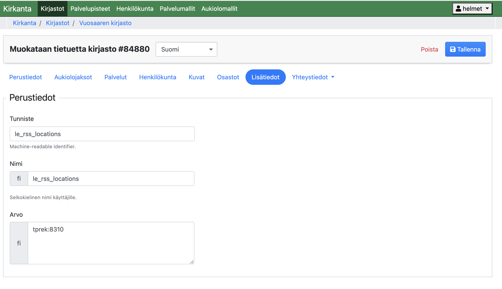
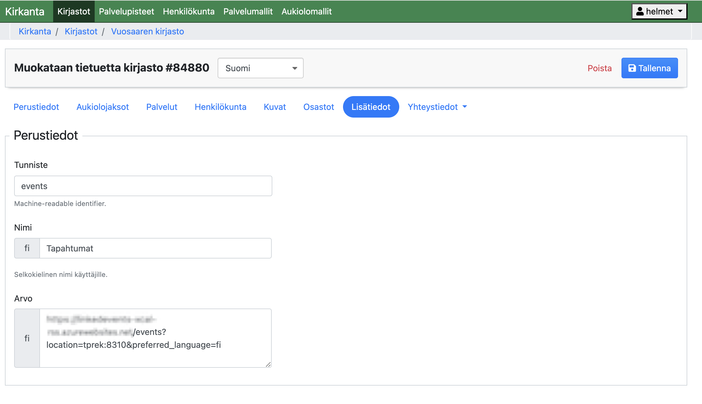

# Service description

This service is intended to produce an XCal enabled RSS feed from the Linked Events results of one or more locations. The services will create feeds in Finnish, Swedish and English so that it will first look for data in the preferred language for an event in the Linked Events and if it is not available, use data in the language that comes first in the event.
The RSS feeds created by this service contain all the events for a given Linked Events location with as much data in the preferred language as possible. Note that this also means that the resulting feeds are in mixed language.

# Technical description

The service depends on Kirkanta for library service point id to Linked Events location id mapping (one to many). Likewise, Kirkanta stores the events RSS feed URL pointing to this service.

The service is intended to be run in a (Docker) container. The Docker container consists of a FastAPI Python application and an internal memcached instance integrated via file socket. In addition to memcached in the container, the FastAPI app uses internally APScheduler and Pebble for feed updates. This way, only a single container is used without any external services needed to deployed to run the application.

At container launch the internal memcahced will be empty and the service will immediately start an update process to populate the cahce. The scheduled task will then refresh the cache as configured in the .env file (default: hourly) from that point of time onwards.

Note that until the first run is complete some RSS feeds for some service points might not exist. The service will return 404 for those. Also note that it will take the amount of time configured in the .env files for new or updated events to show in the service point feed. This is a design decision so that the container can be run with minimal CPU and RAM resources and still be responsive enough.

# Instructions

In order to use this service you need to:
- configure the .env file
- prepare your service point mapping and RSS feed configurations in Kirkanta
- deploy to a Docker container host

## Configure the .env file 

Copy the included .env.example file to .env and replace the variables that correspond to your Linked Events and Finna instances.

See the table below for reference:

| Environment variable | Purpose | Example value |
| - | - | - |
| FEED_BASE_URL | Base URL of the RSS feed. RSS feeds contain an URL pointing to the feed itself. Each feed generated contains this URL and the locations and language parameters. <br/> **NOTE:** This is a part of the RSS spec, and required for the feed to pass validation, but is not shown in Finna. | https://example.org/ |
| LINKED_EVENTS_BASE_URL | Your LinkedEvents API endpoint base URL. <br/> **NOTE:** *Make sure to replace this with your own!* | https://api.hel.fi/linkedevents/v1 |
| EVENT_URL_TEMPLATE | Finna LinkedEvents event template URL. The links in the RSS feed will point to this URL. <br/>  **NOTE:** *you should only need to replace the subdomain part e.g. n in n.finna.fi*.  | https://helmet.finna.fi/FeedContent/LinkedEvents?id={id} |
| CACHE_TTL | Cache update interval in seconds. | 3600 |
| CACHE_MAX_SIZE | The maximum amount of entries in the cache. | 3600 |
| UVICORN_WORKERS | The amount of worker processess to handle incoming web requests. | 4 |
| CONSORTIUM_ID | The consortium id for your library consortium from Kirkanta. The default value is Helmet. <br/> **NOTE:** *Replace this with your own consortium ID!* | 2093 |
| KIRKANTA_BASE_URL | The base URL of Kirkanta API | https://api.kirjastot.fi/v4 |
| API_CLIENT_POOL_SIZE | The number of concurrent feed update processes. | 10 |
| API_CLIENT_TIMEOUT_SECONDS | The timeout value after which a feed update process for a particular service point id is killed. Note that a low value here will likely result in missing data. | 300 |
| API_CLIENT_RETRIES | The amount of retries the API client tries in case of LinkedEvents failures. | 3 |
| SKIP_SUPER_EVENTS | Boolean value to configure if super events should be ignored or not. | 1 | 
| LOAD_IMAGES_FROM_API | Boolean value to configure if the feed update agent should also process the feed entry image to include proper file size and image dimensions. <br/> **NOTE:** *There is no real need to set this to 1 as Finna doesn't need the actual values, but shows the images just as well with placeholder values, too.* | 0 |
| LOG_LEVEL | The log level (DEBUG,INFO,WARNING,ERROR and CRITICAL) which the service uses. | INFO |

## Prepare your service point mapping and RSS feed configurations in Kirkanta

**NOTE!** Since Kirkanta has only a production environment, *once you set any library service point URLs there to point to this service you are effectively in production*. 

This part of the documentation is in Finnish as it's intended for the people who manage library service point data.

1. Luo kirkannassa jokaiselle kirjaston toimipaikalle "Lisätiedot" -osioon "le_rss_locations" -niminen avain. Aseta sen arvoksi pilkulla erotettuna, ilman väliyöntejä, ne LinkedEvents -location id:t, joiden tapahtumat haluat näkyville kirjaston syötteeseen. <br/>Tämä kenttä tarvitsee lisätä ainoastaan yhdelle kielelle (Suomi) 
2. Jos olet kloonannut tämän repositorion omalle tietokoneellesi ja sinulla on Docker asennettuna, voit testata syötettä omalla tietokoneellasi suorittamalla alla kappaleessa Deploy to Docker container host kuvatut ohjeet
3. Saadaksesi syötteen näkyville Finnaan, lisää kaikille kielille omat syötteet, jotka osoittavat siihen osoitteeseen, johon olet julkaissut (deployed) sovelluksen. Kyse on Docker-ajoalustasi sovellukseen osoittava julkinen URL, johon on lisätty /events -kontekstipolkuun:
    * location -parametriin samat LinkedEventsin sijainnit (location) kuin mitä lisäsit toimipaikan le_rss_locations -kenttään.
    * preferred_language -parametriin kunkin kieliversion mukainen tunniste (fi, en, sv)
    * Esimerkki-URL: <br/> https://sovelluksen-osoite-omalla-docker-ajoalustalla.kaupunki.fi/events?linkedevents_location:1234&preferred_languange=fi 

## Deploy to Docker container host

Before running the service in your docker container host, you can test to locally with Docker.

After configuring the enviroment variables as specified earlier, simply build and run the container

```
docker-compose build
docker-compose up
```

The application will start and respond on port 8000 (see docker-compose.yml for more details)

The instructions for Docker container hosts vary, but the easiest way to run the service is to build and run the included docker-compose.yml 

## Development environment


# Further development

This application is designed and developed with the requirements and constraints of Helmet libraries. It expects Sentry monitoring which must be configured in order for the service to work properly. 

**NOTE!** Although running already in production for Helmet, this service is not actively maintained by the City of Helsinki Executive Office application maintenance team. If you choose to deploy this service in production you are responsible for maintaining the security of the service yourself.
